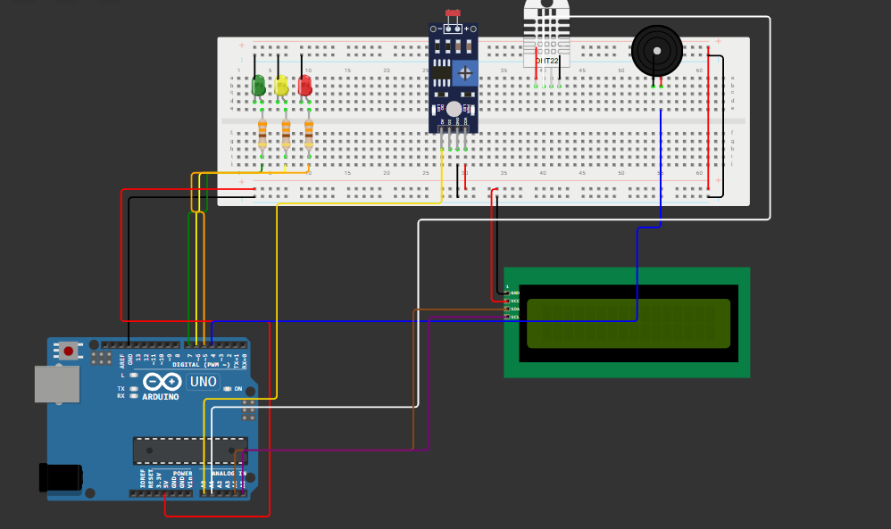

# ORBYN Environment

  

> Inteligência espacial para transformar dados territoriais em decisões mais inteligentes.

## A História da ORBYN

O mundo está mudando em uma velocidade sem precedentes.

O crescimento acelerado das cidades, as mudanças climáticas e a expansão das atividades agrícolas trouxeram novos desafios para a sociedade. Problemas como ocupação desordenada do solo, desperdício de recursos naturais, falhas na infraestrutura urbana, baixa eficiência agrícola e riscos ambientais tornaram-se cada vez mais frequentes.

Apesar da enorme quantidade de informações geradas diariamente, muitas decisões ainda são tomadas com base em dados fragmentados, dificultando a identificação de problemas antes que eles causem impactos significativos.

Foi diante desse cenário que nasceu a **ORBYN Environment**.

A ORBYN foi idealizada para utilizar tecnologia, análise territorial e inteligência artificial na construção de soluções capazes de compreender melhor o comportamento de cidades e áreas rurais.

Seu propósito é transformar grandes volumes de dados geográficos, ambientais e territoriais em informações estratégicas, permitindo que governos, empresas, pesquisadores e produtores rurais tomem decisões mais rápidas, precisas e sustentáveis.

Mais do que uma plataforma tecnológica, a ORBYN representa uma visão de futuro: um mundo onde os dados ajudam a prevenir problemas, otimizar recursos e promover um desenvolvimento mais equilibrado entre o ambiente urbano e rural.

---

## O Problema

Atualmente, a análise territorial enfrenta diversos desafios:

* Crescimento urbano desordenado;
* Baixa eficiência na utilização do solo;
* Desperdício de recursos hídricos;
* Dificuldade de monitoramento ambiental;
* Falta de integração entre diferentes fontes de dados;
* Respostas lentas diante de riscos ambientais.

Esses fatores impactam diretamente a qualidade de vida da população, a produtividade agrícola e a sustentabilidade das regiões.

---

## Nossa Solução

A ORBYN propõe uma plataforma inteligente de análise geoespacial capaz de centralizar informações urbanas e rurais em um único ambiente.

Por meio da combinação de dados ambientais, indicadores territoriais, imagens de satélite e inteligência artificial, a plataforma busca gerar conhecimento útil para apoiar a tomada de decisões.

### Principais funcionalidades

* Visualização de regiões urbanas e rurais;
* Mapas interativos;
* Dashboards analíticos;
* Alertas ambientais;
* Recomendações automáticas;
* Relatórios estratégicos;
* Monitoramento territorial.

---

## Objetivo da Solução

Desenvolver uma plataforma capaz de transformar dados em conhecimento, permitindo:

* Melhor planejamento urbano;
* Uso mais eficiente do solo agrícola;
* Identificação de áreas de risco;
* Otimização de recursos naturais;
* Tomada de decisões baseada em evidências;
* Promoção de práticas mais sustentáveis.

---

# Protótipo Edge Computing

Como prova de conceito da plataforma ORBYN Environment, foi desenvolvido um sistema embarcado utilizando Arduino Uno para realizar o monitoramento ambiental local e a identificação de possíveis situações de risco.

O protótipo simula a coleta de dados ambientais em áreas urbanas e rurais, demonstrando como dispositivos de Edge Computing podem processar informações diretamente na origem antes de enviá-las para sistemas de análise territorial.

Além da coleta de dados, o sistema também é capaz de emitir alertas visuais e sonoros quando condições consideradas críticas são identificadas.

---

# Componentes Utilizados

## Hardware

* Arduino Uno
* Sensor DHT22
* Sensor de Luminosidade (LDR)
* Display LCD I2C 16x2
* LED Verde
* LED Amarelo
* LED Vermelho
* Buzzer
* Protoboard
* Jumpers

## Software

* Arduino IDE
* Linguagem C++
* Biblioteca DHT
* Biblioteca Wire
* Biblioteca LiquidCrystal_I2C

---

# Explicação do Funcionamento

O sistema realiza leituras contínuas da temperatura, umidade e luminosidade do ambiente.

Os dados são processados localmente pelo Arduino, simulando o conceito de Edge Computing utilizado pela plataforma ORBYN.

O sensor DHT22 é responsável por coletar informações de temperatura e umidade, enquanto o sensor LDR representa indicadores territoriais monitorados pela plataforma, como expansão urbana, ocupação do solo e alterações ambientais.

Com base nos valores coletados, o sistema classifica a situação em três níveis:

### Estado Normal

* LED Verde ligado;
* Sistema operando normalmente;
* LCD exibe mensagens informativas da ORBYN.

### Estado de Atenção

* LED Amarelo ligado;
* Possível alteração ambiental detectada;
* LCD apresenta mensagens de monitoramento.

### Estado Crítico

* LED Vermelho ligado;
* Buzzer acionado;
* LCD apresenta mensagens de alerta.

---

# Fluxo de Execução

1. Coleta de temperatura e umidade pelo DHT22;
2. Coleta de luminosidade pelo sensor LDR;
3. Processamento local dos dados pelo Arduino;
4. Classificação do ambiente em Normal, Atenção ou Crítico;
5. Acionamento dos LEDs e buzzer;
6. Exibição das informações no display LCD;
7. Atualização contínua dos dados.

---

# Estrutura do Circuito
## Diagrama do Circuito

O circuito abaixo representa o protótipo de Edge Computing desenvolvido para a ORBYN Environment.

  

## Sensor DHT22

| Pino DHT22 | Arduino |
| ---------- | ------- |
| VCC        | 5V      |
| DATA       | A1      |
| GND        | GND     |

## Sensor LDR

| Sensor | Arduino |
| ------ | ------- |
| VCC    | 5V      |
| GND    | GND     |
| AO     | A0      |

## LEDs

| LED      | Arduino |
| -------- | ------- |
| Verde    | Pino 7  |
| Amarelo  | Pino 6  |
| Vermelho | Pino 5  |

## Buzzer

| Componente | Arduino |
| ---------- | ------- |
| Positivo   | Pino 4  |
| Negativo   | GND     |

## Display LCD I2C

| Pino LCD | Arduino |
| -------- | ------- |
| VCC      | 5V      |
| GND      | GND     |
| SDA      | A4      |
| SCL      | A5      |

---

# Aplicação na ORBYN

O protótipo demonstra como dispositivos inteligentes podem coletar informações diretamente no território e fornecer respostas rápidas para apoiar a tomada de decisões.

Na versão completa da plataforma, dados provenientes de sensores, imagens de satélite e sistemas geoespaciais seriam integrados para monitorar:

* Expansão urbana;
* Uso do solo;
* Condições ambientais;
* Recursos hídricos;
* Planejamento territorial;
* Áreas de risco.

A proposta evidencia a aplicação prática de Edge Computing na coleta e processamento inicial dos dados antes da integração com sistemas maiores de Inteligência Artificial e análise geoespacial.

## Vídeo do Pitch

Para apresentar a proposta da ORBYN Environment, foi desenvolvido um vídeo de Pitch que demonstra o contexto do problema, os objetivos do projeto, a solução proposta e os benefícios da utilização de inteligência espacial para apoiar decisões territoriais.

O vídeo apresenta:

* O cenário atual dos desafios urbanos e rurais;
* A proposta da ORBYN Environment;
* As funcionalidades da plataforma;
* A aplicação de tecnologias de análise geoespacial;
* O protótipo de Edge Computing desenvolvido;
* Os benefícios da tomada de decisão baseada em dados.

### Acesse o vídeo do Pitch

**Link:** https://youtu.be/eMag72sRrt0

---

## Link do Projeto

Todo o material relacionado ao desenvolvimento da ORBYN Environment está disponível no repositório oficial do projeto.

No repositório é possível encontrar:

* Código-fonte;
* Documentação técnica;
* Diagramas do sistema;
* Código do protótipo Arduino;
* Apresentações;
* Arquivos complementares.

### Acesse o projeto
link do projeto : https://wokwi.com/projects/466213121512634369
---

## Conclusão

A ORBYN Environment foi criada para transformar dados territoriais em informações estratégicas capazes de apoiar decisões mais inteligentes e sustentáveis.

Por meio da integração entre análise geoespacial, inteligência artificial e monitoramento ambiental, a plataforma busca contribuir para um melhor planejamento urbano, maior eficiência no uso do solo e uma gestão mais consciente dos recursos naturais.

A proposta demonstra como a tecnologia pode ser utilizada para compreender melhor o território, antecipar desafios e auxiliar na construção de cidades e áreas rurais mais resilientes e sustentáveis.
## Equipe ORBYN

* **Eduardo Felix Frois Silva** — RM 574103
* **Gabriel Henrique Ongarelli Reis** — RM 572636
* **Lucas Rodrigues dos Santos** — RM 571778
* **Matheus de Amorim Brito** — RM 572435
* **Thiago Gomes Nascimento** — RM 569436

